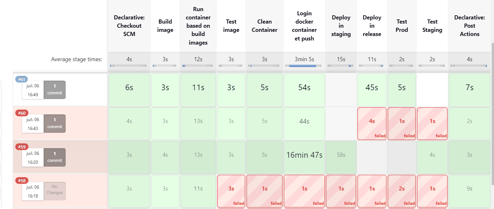

# Documentation du Jenkinsfile

## Environnement
Cette section définit les variables d'environnement utilisées dans le pipeline Jenkins.

```groovy
environment{
    IMAGE_NAME = 'webstatic'
    PORT_EXPOSED = 81
    REGISTRY_URL = 'registry.example.com'
    IMAGE_TAG = "1.0"
    SSH_USER_RELEASE = "root"
    SSH_USER_STAGING = "administrator"
    SSH_HOST_STAGING = "192.168.100.32"
    SSH_HOST_RELEASE = "143.44.162.121"
    DOCKERHUB_AUTH = credentials('DOCKER_HUB')
}
```

## Agent
Cette section spécifie l'agent Jenkins à utiliser. `agent none` signifie qu'aucun agent global n'est défini et chaque stage peut spécifier son propre agent.

```groovy
agent none
```

## Stages
Cette section définit les étapes du pipeline. Chaque stage représente une phase du processus CI/CD.

### 1. Build image
Construit l'image Docker.

```groovy
  stage ('Build image') {
    steps {
        script {
            sh 'docker build -t ${REGISTRY_URL}/${IMAGE_NAME}:${IMAGE_TAG} .'
        }
    }
}
```

### 2. Run container based on build images
Exécute un conteneur basé sur l'image Docker construite.

```groovy
    stage ('Run container based on build images') {
    steps {
        script {
            sh '''
                    echo "Clean Environment"
                    docker rm -f ${IMAGE_NAME} || echo "container does not exist"
                    docker run --name ${IMAGE_NAME} -d -p ${PORT_EXPOSED}:80 -e PORT=80 ${REGISTRY_URL}/${IMAGE_NAME}:${IMAGE_TAG}
                    sleep 5
                '''
        }
    }
}
```

### 3. Test image
Teste l'image Docker en envoyant une requête HTTP au conteneur.

```groovy
stage ('Test image') {
    steps {
        script {
            sh '''
                    curl http://172.17.0.1:${PORT_EXPOSED} | grep -i 'Dimension'
                '''
        }
    }
}
```

### 4. Clean Container
Arrête et supprime le conteneur Docker.

```groovy
stage ('Clean Container') {
    steps {
        script {
            sh '''
                    docker rm -f ${IMAGE_NAME}
                '''
        }
    }
}
```

### 5. Login docker container et push
Se connecte à Docker Hub et pousse l'image Docker.

```groovy
 stage ('Login docker container et push') {
    steps {
        script {
            sh '''
                   echo ${DOCKERHUB_AUTH_PSW} | docker login ${REGISTRY_URL} -u ${DOCKERHUB_AUTH_USR} --password-stdin
                   docker push ${REGISTRY_URL}/${IMAGE_NAME}:${IMAGE_TAG}
                  '''
        }
    }
}
```

## Post Actions
Définit les actions à effectuer après l'exécution des stages, en fonction du succès ou de l'échec du pipeline.

```groovy
post {
    success {
        slackSend (color: '#00FF00', message: "NAME - SUCCESSFUL: Job '${env.JOB_NAME} [${env.BUILD_NUMBER}]' (${env.BUILD_URL})")
    }
    failure {
        slackSend (color: '#FF0000', message: "NAME - FAILED: Job '${env.JOB_NAME} [${env.BUILD_NUMBER}]' (${env.BUILD_URL})")
    }
}
```

## Explications supplémentaires
- **`agent any`** : Utilise n'importe quel agent disponible pour exécuter les étapes du stage.
- **`sh`** : Exécute une commande shell sur l'agent Jenkins.
- **`script`** : Permet d'exécuter des blocs de script groovy.
- **`slackSend`** : Envoie une notification Slack avec une couleur spécifique et un message décrivant l'état du job Jenkins.

Ce pipeline CI/CD gère le processus complet de construction, test, nettoyage et déploiement d'une image Docker, avec des notifications Slack pour informer de l'état du job.



